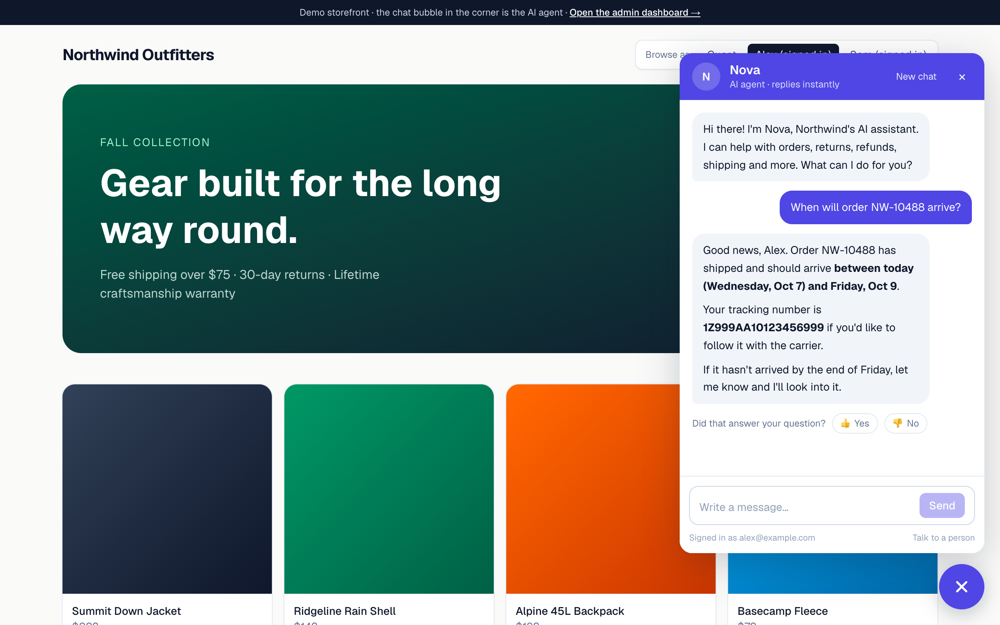
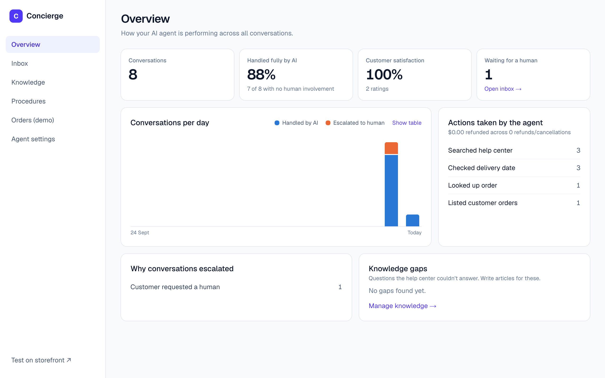
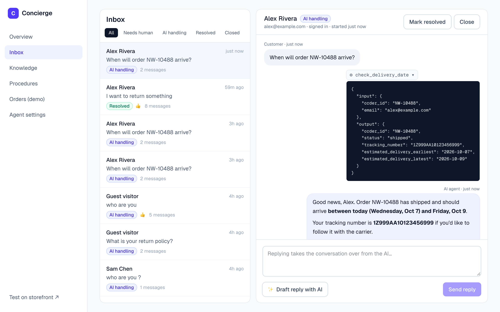
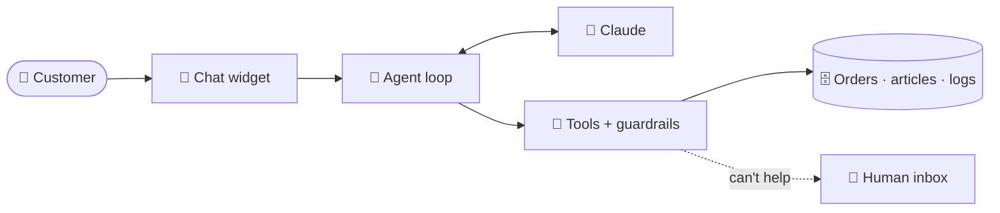

<div align="center">

# 🛎️ Concierge

### An AI customer-support agent that resolves issues end to end

Answers from your help center · takes real actions under enforced rules · hands off to humans with full context

<br/>


**[Quick start](#-quick-start)** · **[Features](#-features)** · **[How it works](#-how-it-works)** · **[Architecture](docs/ARCHITECTURE.md)** · **[Key facts](facts/README.md)**

<br/>



<sub>The agent checks a signed-in customer's order and answers with a delivery window and tracking number.</sub>

</div>

---

## ✨ Overview

Concierge is an **AI agent**, not a scripted chatbot. It understands the customer, decides which tools to use, and **resolves** the request instead of linking to an FAQ: in the spirit of platforms like Decagon and Intercom Fin.

| | |
|---|---|
| 💬 **Grounded answers** | Searches the help center before answering, so replies follow company policy |
| ⚡ **Real actions** | Order lookup, delivery estimates, cancellations, address changes and refunds |
| 🔒 **Rules in code** | Refund limits, order ownership and status checks are enforced by the tools themselves |
| 🙋 **Human handoff** | Escalates with a summary; teammates reply from an inbox, live in the same chat |
| 🎛️ **No-code control** | Procedures, articles, tone and limits are editable in the admin dashboard |
| 📊 **Built-in analytics** | AI resolution rate, satisfaction, actions taken and knowledge gaps |

---

## 📸 Screenshots

<table>
<tr>
<td width="50%" valign="top">

**Admin overview**

Resolution rate, satisfaction, daily volume, actions taken, escalation reasons and knowledge gaps.

</td>
<td width="50%" valign="top">

**Inbox with tool trace**

Every conversation, the exact tool calls the agent made, and AI-drafted replies for teammates.

</td>
</tr>
</table>

---

## 🚀 Features

<table>
<tr>
<td width="50%" valign="top">

### 💬 Chat widget
- One `<script>` tag on any site
- Streams replies word by word
- Shows live status ("Checking your delivery date…")
- Cites help-center sources
- 👍 / 👎 ratings and "Talk to a person"

</td>
<td width="50%" valign="top">

### 🧠 AI agent
- Claude Opus 5.5 (Sonnet 5.5 selectable)
- 8 tools with strict input schemas
- Adaptive thinking and configurable effort
- Prompt caching and refusal fallback
- Up to 10 reasoning steps per message

</td>
</tr>
<tr>
<td width="50%" valign="top">

### 🔒 Guardrails
- Refunds capped at a configurable limit
- Customers can only access their own orders
- Cancellations and address changes only before shipping
- Every tool input validated with Zod
- Prompt-injection attempts can't bypass the rules

</td>
<td width="50%" valign="top">

### 👥 Admin dashboard
- **Inbox:** handoff summaries, tool traces, AI-drafted replies
- **Knowledge:** article editor and knowledge gaps
- **Procedures:** plain-language playbooks
- **Settings:** name, tone, model, effort, refund limit
- **Overview:** analytics and trends

</td>
</tr>
</table>

---

## ⚙️ How it works



1. The customer writes in the chat widget.
2. The **agent loop** sends the conversation and the tool list to Claude.
3. Claude either replies or **requests a tool**, such as `check_delivery_date`.
4. The tool **validates the input, enforces the rules**, runs, and returns a result.
5. The loop repeats until Claude writes the final reply, which streams to the customer.

> [!TIP]
> **Claude decides; the code enforces.** The model chooses what to do, but every action passes through checks it cannot override.

### 🧰 Tools

| | Tool | What it does | Enforced rule |
|:-:|---|---|---|
| 🔎 | `search_knowledge_base` | Searches help articles | Logs a knowledge gap when nothing matches |
| 📦 | `lookup_order` | Order details | Order number + matching email |
| 🚚 | `check_delivery_date` | Delivery estimate; flags delays | Same ownership check |
| 🗂️ | `list_customer_orders` | A customer's orders | Signed-in customers see only their own |
| ❌ | `cancel_order` | Cancels an order | Only while `processing` |
| 🏠 | `update_shipping_address` | Changes the address | Only while `processing` |
| 💸 | `issue_refund` | Refunds to the original payment | Within limit and remaining balance |
| 🙋 | `escalate_to_human` | Hands off with a summary | Records the reason for the inbox |

---

## 🏁 Quick start

> [!NOTE]
> Requires **Node.js 24+** (uses the built-in `node:sqlite`) and a [Claude API key](https://platform.claude.com).

```bash
git clone https://github.com/pritmon/concierge-ai-agent.git
cd concierge-ai-agent
npm install
cp .env.example .env.local     # add your ANTHROPIC_API_KEY
npm run dev
```

| Open | What you'll see |
|---|---|
| **http://localhost:3000** | Demo storefront with the chat widget. Use **Browse as** to switch between a guest and signed-in customers |
| **http://localhost:3000/admin** | Admin dashboard |

The database (`data/support.db`) is created and filled with demo articles, procedures and orders on first run. Delete it to reset.

### 🧪 Try these

| Browse as | Ask | Expected result |
|---|---|---|
| Anyone | *"What's your return policy?"* | Answer grounded in the help center, with sources |
| **Alex** | *"When will order NW-10488 arrive?"* | Delivery window and tracking number |
| **Sam** | *"Cancel my rain shell order"* | Finds NW-10502, asks to confirm, cancels |
| Guest | *"Refund NW-10421, email alex@example.com"* | $229 is over the $100 limit, so it escalates with a summary |
| Anyone | *"I'm going to file a chargeback"* | The upset-customer procedure hands off immediately |

Then open **Admin → Inbox** to see the handoff summary and tool traces, and try **✨ Draft reply with AI**.

---

## 🧩 Embed on any website

```html
<script src="https://YOUR-DOMAIN/widget.js"
        data-customer-email="jane@example.com"
        data-customer-name="Jane Doe"
        async></script>
```

Leave out the `data-customer-*` attributes for anonymous visitors.

---

## 🛠️ Tech stack

| Layer | Technology |
|---|---|
| **Framework** | Next.js 16 (App Router) · React 19 · TypeScript |
| **AI** | Claude Opus 5.5 via `@anthropic-ai/sdk`: tool use, streaming, adaptive thinking, prompt caching |
| **Data** | SQLite (`node:sqlite`) · Zod validation |
| **Search** | BM25 keyword ranking |
| **Realtime** | Server-Sent Events |
| **Styling** | Tailwind CSS v4 |

<details>
<summary><b>📁 Project structure</b></summary>

```
app/
├── page.tsx                demo storefront
├── widget/                 chat widget page
├── admin/                  overview · inbox · knowledge · procedures · orders · settings
└── api/                    chat (streaming), conversations, admin APIs
lib/
├── agent/run.ts            agent loop
├── agent/tools.ts          tools and guardrails
├── agent/copilot.ts        reply drafts for teammates
├── db.ts                   database
├── kb.ts                   help-center search
└── seed.ts                 demo data
components/ChatWidget.tsx   customer chat UI
public/widget.js            embed script
docs/                       architecture guide and images
facts/                      key concepts and glossary
```

</details>

---

## 📚 Documentation

| | Guide | Covers |
|:-:|---|---|
| 🏛️ | **[Architecture](docs/ARCHITECTURE.md)** | System diagrams, request lifecycle, agent loop, data model, code map |
| 📘 | **[Key facts & concepts](facts/README.md)** | Agents vs chatbots, tools, guardrails, design decisions, glossary |

---

## 🗺️ Roadmap

| Status | Item |
|:-:|---|
| ✅ | Agent loop with 8 tools and guardrails in code |
| ✅ | Human handoff inbox with AI-drafted replies |
| ✅ | Procedures, knowledge base and settings editors |
| ✅ | Analytics and knowledge gaps |
| ✅ | Delivery estimates with delay detection |
| ⏳ | Admin authentication |
| ⏳ | Signed customer identity (HMAC) |
| ⏳ | Automated evaluation suite |
| ⏳ | Real integrations (Shopify, Stripe) |
| ⏳ | Postgres and rate limiting |
| ⏳ | Email and voice channels |

> [!IMPORTANT]
> This is a working MVP. Before real customers use it, add admin authentication and signed customer identity: `/admin` is currently open and the widget trusts the email it's given.

---

<div align="center">

Built with **Next.js** and **Claude** · [Architecture](docs/ARCHITECTURE.md) · [Key facts](facts/README.md)

</div>
