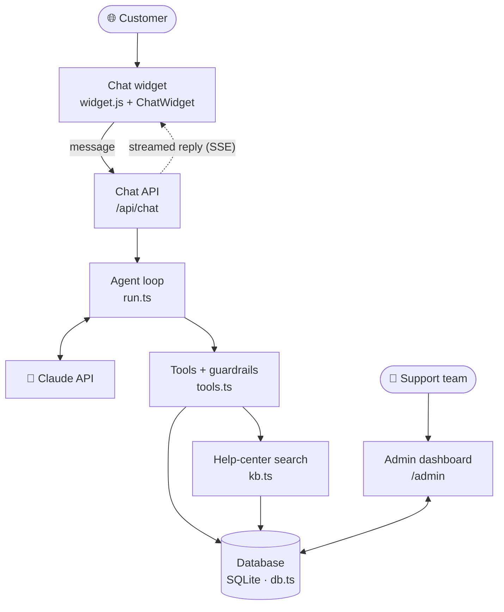
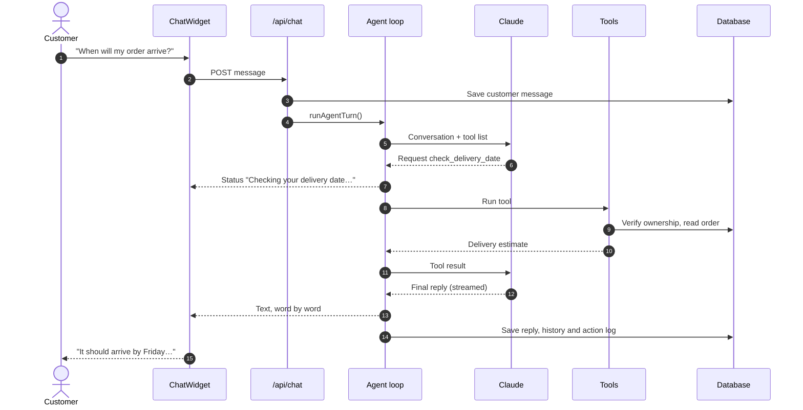
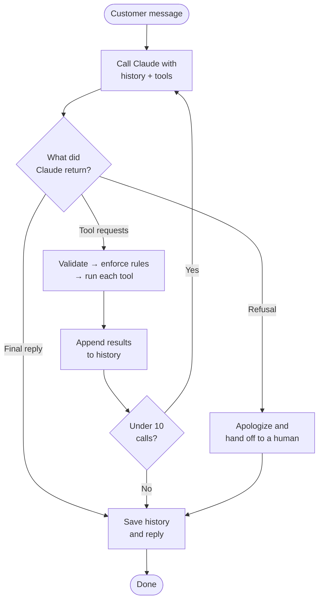
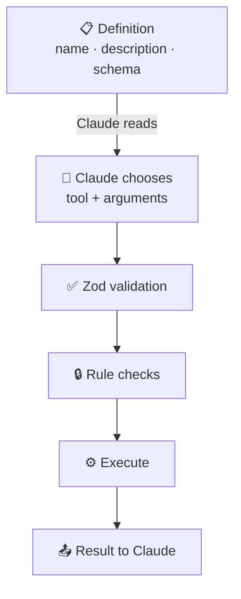
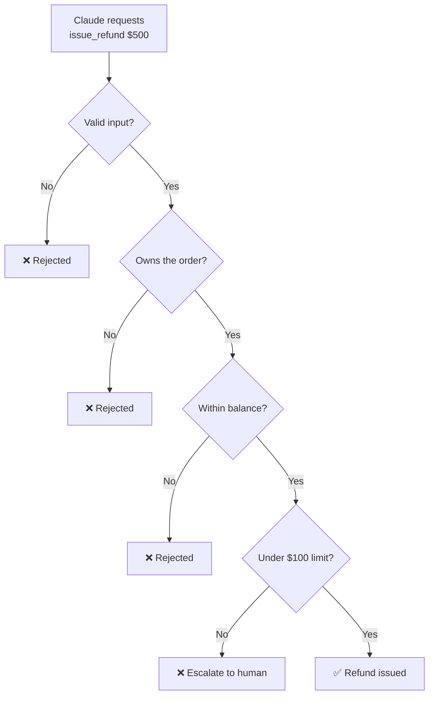
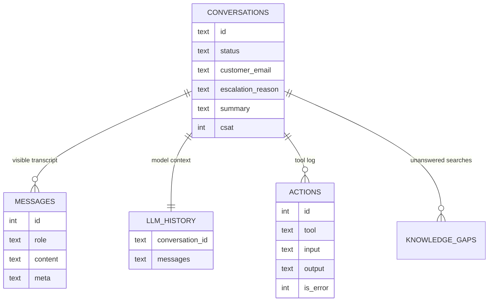
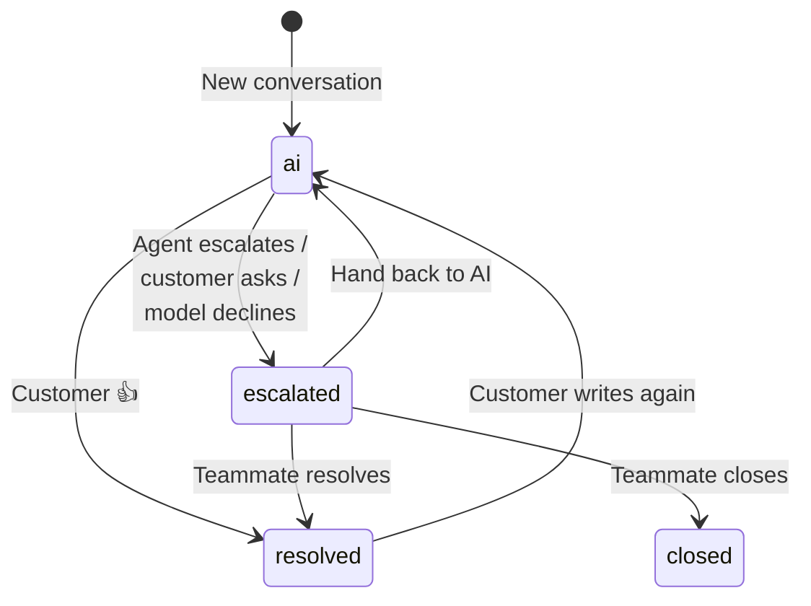
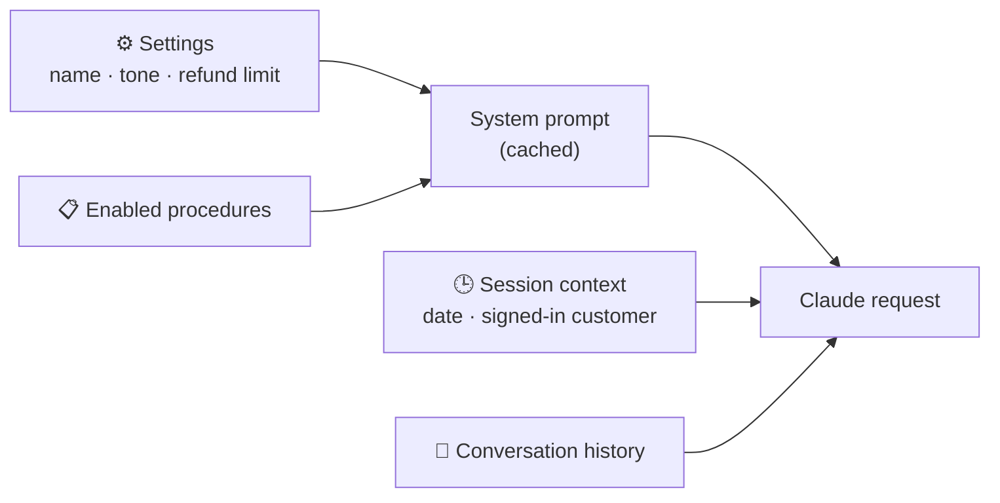

<div align="center">

# 🏛️ Concierge Architecture

**How an AI support agent turns a customer message into a resolved issue**

`Next.js 16` · `TypeScript` · `Claude Opus 5.5` · `SQLite` · `Server-Sent Events`

</div>

---

## 📑 Contents

| | Section | What you'll learn |
|:-:|---|---|
| 1 | [System overview](#1-system-overview) | The main components and how they connect |
| 2 | [Request lifecycle](#2-request-lifecycle) | One message, from keystroke to reply |
| 3 | [The agent loop](#3-the-agent-loop) | How the agent decides and acts |
| 4 | [Tools](#4-tools) | What the agent can do, and its limits |
| 5 | [Guardrails](#5-guardrails) | Why rules live in code |
| 6 | [Data model](#6-data-model) | Tables and the two conversation histories |
| 7 | [Human handoff](#7-human-handoff) | How conversations move between AI and people |
| 8 | [Prompt design](#8-prompt-design) | System prompt, procedures and caching |
| 9 | [Knowledge search](#9-knowledge-search) | How answers stay grounded |
| 10 | [Code map](#10-code-map) | Which file to open for which change |
| 11 | [Limitations](#11-known-limitations) | What a production deployment needs |

---

## 1. System overview



| Component | Responsibility | Location |
|---|---|---|
| **Embed script** | Adds the chat bubble and iframe to any site | [`public/widget.js`](../public/widget.js) |
| **Chat widget** | Customer UI; renders the streamed reply | [`components/ChatWidget.tsx`](../components/ChatWidget.tsx) |
| **Chat API** | Validates and saves messages; streams events | [`app/api/chat/route.ts`](../app/api/chat/route.ts) |
| **Agent loop** | Talks to Claude, runs tools, repeats until done | [`lib/agent/run.ts`](../lib/agent/run.ts) |
| **Tools** | Actions plus the rules that limit them | [`lib/agent/tools.ts`](../lib/agent/tools.ts) |
| **Search** | Ranks help-center articles | [`lib/kb.ts`](../lib/kb.ts) |
| **Database** | All persistent data | [`lib/db.ts`](../lib/db.ts) |
| **Admin dashboard** | Inbox, knowledge, procedures, settings, analytics | [`app/admin/`](../app/admin/) |

---

## 2. Request lifecycle

Following a signed-in customer who asks **"When will my order arrive?"**



> [!NOTE]
> If a human has taken over the conversation, step 4 is skipped: the message is saved and the AI stays silent.

---

## 3. The agent loop

> An **agent** is a model that chooses its own next steps. One customer message can take several model calls.



### Who does what

| | 🧠 Claude | ⚙️ Application code |
|---|:-:|:-:|
| Understands the customer | ✅ | |
| Chooses which tool to use | ✅ | |
| Writes the reply | ✅ | |
| Validates tool inputs | | ✅ |
| Enforces business rules | | ✅ |
| Executes actions | | ✅ |
| Stores data and logs | | ✅ |

### Claude API settings

| Setting | Value | Purpose |
|---|---|---|
| `model` | `claude-opus-5-5` (configurable) | Reasoning and replies |
| `thinking` | `adaptive` | Claude decides how much to reason |
| `output_config.effort` | `medium` (configurable) | Trades depth for speed and cost |
| `fallbacks` | `"default"` | Retries declined requests on a fallback model |
| `cache_control` | On the stable system prompt | Cheaper, faster repeat calls |
| Streaming | `messages.stream()` | Text appears as it is generated |

---

## 4. Tools

> [!TIP]
> **A tool = a function + a description.** Claude only reads the name, description and input schema. It never sees or runs the code.



| Tool | Purpose | Enforced rule |
|---|---|---|
| 🔎 `search_knowledge_base` | Find help articles | Logs a knowledge gap when nothing matches |
| 📦 `lookup_order` | Order details | Order number and email must match |
| 🚚 `check_delivery_date` | Delivery estimate; flags delays | Same ownership check |
| 🗂️ `list_customer_orders` | A customer's orders | Signed-in customers see only their own |
| ❌ `cancel_order` | Cancel an order | Only while `processing` |
| 🏠 `update_shipping_address` | Change the address | Only while `processing` |
| 💸 `issue_refund` | Refund to original payment | Within the limit and remaining balance |
| 🙋 `escalate_to_human` | Hand off | Records reason and summary |

<details>
<summary><b>➕ How to add a tool</b> (4 steps, all in <code>lib/agent/tools.ts</code>)</summary>

| Step | Add to | Example |
|:-:|---|---|
| 1 | `TOOL_DEFINITIONS` | `{ name, description, strict: true, input_schema }` |
| 2 | `INPUT_SCHEMAS` | `check_delivery_date: OrderAuth` |
| 3 | `TOOL_LABELS` | `"Checking your delivery date"` |
| 4 | `executeTool()` | `case "check_delivery_date": { … }` |

Write the description as an instruction about **when** to use the tool. Claude relies on it to choose.

</details>

---

## 5. Guardrails

> [!IMPORTANT]
> **Prompts guide behavior. Code enforces rules.** Even if Claude is persuaded to request something forbidden, the tool refuses.

| Layer | Protects against | Mechanism |
|---|---|---|
| **Input validation** | Malformed or missing arguments | Zod schemas on every tool and API |
| **Ownership** | Seeing other customers' data | Order number + email; signed-in identity |
| **Business rules** | Over-refunds, late cancellations | Limit, balance and status checks in tools |
| **Loop limit** | Runaway model calls | Maximum 10 calls per message |
| **Refusal handling** | Declined requests | Fallback model, then human handoff |



---

## 6. Data model



| Table | Holds |
|---|---|
| `conversations` | One row per chat, with status and handoff details |
| `messages` | What people see: customer, AI, teammate, system notes (+ tool rows for admins) |
| `llm_history` | The exact Claude message list, including tool calls |
| `actions` | Every tool call, for the inbox and analytics |
| `knowledge_gaps` | Searches that found nothing |
| `articles` · `procedures` · `settings` | Admin-managed configuration |
| `orders` | Demo order system the tools act on |

### Two histories per conversation

| | `messages` | `llm_history` |
|---|---|---|
| **Audience** | Customers and teammates | Claude |
| **Contains** | Readable messages | Text, thinking blocks, tool calls and results |
| **Edited?** | Rows added | **Append-only, never edited** |
| **Why separate** | Clean UI | Accurate model context across turns |

---

## 7. Human handoff



| Trigger | Example |
|---|---|
| 🤖 Agent decides | Refund above the limit; policy doesn't cover it |
| 🙋 Customer asks | "Talk to a person" button |
| 📋 Procedure says so | Chargeback or legal threat |
| ⛔ Model declines | Automatic handoff |

**After handoff:**

1. The AI stops replying to this conversation.
2. The inbox shows the reason and the agent's **handoff summary**.
3. A teammate replies, and the customer sees it live in the same chat.
4. **Draft reply with AI** ([`copilot.ts`](../lib/agent/copilot.ts)) suggests a response.

---

## 8. Prompt design

The system prompt is assembled on every turn from admin-managed data:



| Part | Changes when | Cached? |
|---|---|:-:|
| Role, rules, voice | An admin edits settings | ✅ |
| Procedures | An admin edits procedures | ✅ |
| Tool definitions | Code changes | ✅ |
| Session context | Every conversation | ❌ placed after the cache |
| Conversation history | Every message | — |

> [!TIP]
> Stable content goes **first** and changing content goes **last**. Any change early in the prompt invalidates the cache for everything after it.

### Procedures

| Field | Example |
|---|---|
| **Name** | Refund request |
| **When** | Customer asks for a refund |
| **Steps** | Get order + email → check eligibility → confirm amount → escalate above the limit |

Support teams change behavior through procedures **without a code deploy**, while engineering owns the rules in code.

---

## 9. Knowledge search

| Question | Answer |
|---|---|
| **Algorithm** | BM25 keyword ranking ([`lib/kb.ts`](../lib/kb.ts)) |
| **When used** | Before any policy or how-to answer |
| **Title weight** | Titles count double |
| **No match** | Agent says it isn't sure, offers a human, logs a **knowledge gap** |

| Approach | Strength | Best for |
|---|---|---|
| **BM25** *(current)* | Simple, no extra services | Small help centers |
| **Vector search** | Understands meaning and synonyms | Large help centers |
| **Hybrid** | Combines both | Production at scale |

---

## 10. Code map

| I want to… | Open |
|---|---|
| Give the agent a new capability | [`lib/agent/tools.ts`](../lib/agent/tools.ts) |
| Change how the agent behaves | [`lib/agent/run.ts`](../lib/agent/run.ts) → `buildSystemPrompt()`, or add a Procedure in the admin |
| Improve search results | [`lib/kb.ts`](../lib/kb.ts) |
| Store new data | [`lib/db.ts`](../lib/db.ts) → `SCHEMA` (delete `data/support.db` to recreate) |
| Change the chat interface | [`components/ChatWidget.tsx`](../components/ChatWidget.tsx) |
| Add an admin page | `app/admin/<page>/page.tsx` + `app/api/admin/<page>/route.ts` |
| Change demo data | [`lib/seed.ts`](../lib/seed.ts) |

<details>
<summary><b>📁 Full directory layout</b></summary>

```
app/
├── page.tsx                      Demo storefront
├── widget/page.tsx               Chat widget page
├── admin/                        Dashboard
│   ├── page.tsx                  Overview & analytics
│   ├── inbox/                    Conversations & handoffs
│   ├── knowledge/                Articles & knowledge gaps
│   ├── procedures/               Playbooks
│   ├── orders/                   Demo orders
│   └── settings/                 Agent settings
└── api/
    ├── chat/                     Customer messages (streaming)
    ├── conversations/[id]/       Messages · feedback · handoff
    ├── widget-config/            Widget branding
    └── admin/                    Dashboard APIs
lib/
├── agent/
│   ├── run.ts                    Agent loop
│   ├── tools.ts                  Tools & guardrails
│   └── copilot.ts                Reply drafts
├── db.ts                         Database
├── kb.ts                         Search
├── schemas.ts                    Shared validation
└── seed.ts                       Demo data
components/
├── ChatWidget.tsx                Customer chat UI
├── Markdown.tsx                  Safe reply formatting
└── admin/                        Dashboard UI
public/widget.js                  Embed script
```

</details>

---

## 11. Known limitations

| Area | Current state | Production approach |
|---|---|---|
| 🔐 Admin access | No login | SSO and roles |
| 🪪 Customer identity | Trusts the email from the host site | Signed identity token (HMAC) |
| 🔌 Integrations | Demo orders in SQLite | Shopify, Stripe, order systems |
| 🗄️ Database | SQLite | Postgres |
| 🧪 Testing | Manual | Automated evaluation suite |
| 🕒 Dates | UTC on the server | Customer's timezone from the widget |
| 📡 Live updates | Polling | Push updates |

---

<div align="center">

**Related:** [README](../README.md) · [Key facts & concepts](../facts/README.md)

</div>
